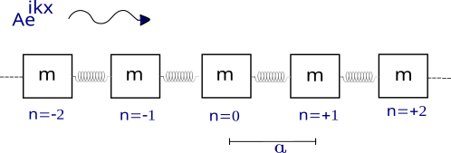

# Dispersion-Relation
We will consider a one-dimensional crystal lattice with all atoms being equal, each with mass m, equally spaced with an atomic distance of a, and with the same elastic coupling constant α equal to 1. We can visualize this system classically as a harmonic chain of coupled masses and springs, as illustrated in Figure 1.

Figure 1: Illustration of a one-dimensional monoatomic chain with equally spaced atoms and the same elastic coupling constant.

We define the vibrational mode as a plane wave propagating in the chain from left to right, in the
form:

$$x_n = Ae^{i(kna−ωt)}  \tag{1} $$

where A is the amplitude of the plane wave, k is the wave vector, n is the site where the atom is
located, a is the atomic distance (which we will assume to be equal to 1 from now on), ω is the angular
frequency, and t is the time. Taking the site n = 0 as the reference point, we can write the equation
of motion for the mass m at the site n = 0 based on Newton’s laws,

$$m \frac{d^2x_0}{dt^2} = α(x_{−1} + x_{+1} − 2x_0)  \tag{2} $$

Using the normal mode equation of the incident wave (1) in the equation of motion (2), we can
arrive at the dispersion relation for the wave propagating in a one-dimensional monoatomic chain. The
dispersion relation connects the frequency with the wave vector. Since the chain is one-dimensional
and the wave vector dictates the direction of wave propagation, we can refer to it as the wave number.

$$m ω^2 = 2α(1 − cos(ka))  \tag{3} $$

Due to the periodicity of equation (3), since the relationship remains the same with k → k + 2π,
we can plot the dispersion relation from −π to π.

